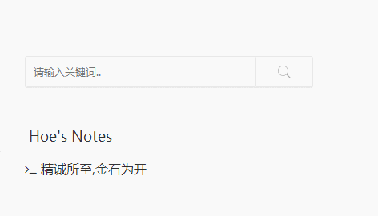

# 打字特效插件`ActivatePowerMode`

## 使用方法

- 下载本插件，解压放到`usr/plugins/`目录中
- 文件夹名改为`ActivatePowerMode`
- 登录管理后台，激活插件

## 插件说明

插件基于`activate-power-mode.js`。熊猫小A修改之使得在文章与页面编辑界面也可以使用。

## 作者

* [Hoe](http://www.hoehub.com)
* [熊猫小A](https://blog.imalan.cn)